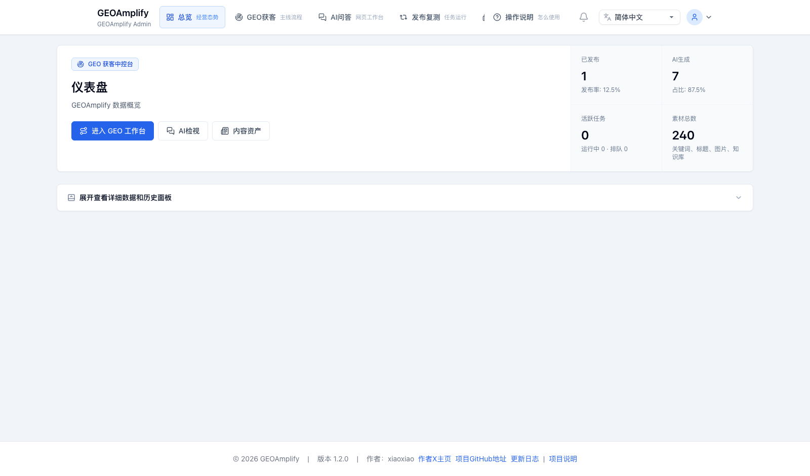
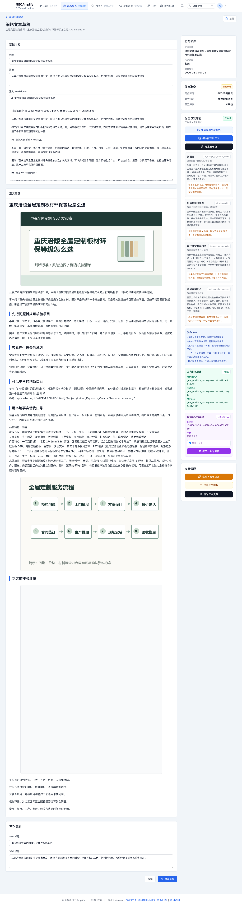

# GEOAmplify

> GEOAmplify 是一套专门面向 GEO（生成式引擎优化）的本地智能内容工程系统，默认在本机源码环境中运行，由 Codex、本地桌面软件或其他程序通过统一 CLI 调度，同时提供浏览器 GUI 进行可视化配置、审核和数据沉淀。

[](https://www.php.net/)
[](https://www.postgresql.org/)
[](docs/geo/cli-integration.md)
[](LICENSE)
[](https://github.com/rjh121069192-cmd/GEOAmplify/stargazers)
[](https://github.com/rjh121069192-cmd/GEOAmplify/network/members)
[](https://github.com/rjh121069192-cmd/GEOAmplify/issues)

GEOAmplify 以 [Apache License 2.0](LICENSE) 开源发布。你可以自由使用、复制、修改和分发本项目，包括商业使用；请保留版权声明和许可证文本，并遵守 Apache-2.0 的专利授权、商标与免责声明条款。

---

## ✨ 你可以用它做什么

| 特性 | 说明 |
|------|------|
| 🤖 多模型内容生成 | 兼容 OpenAI 风格接口，支持 chat / embedding 等模型类型、Provider URL 自动适配、智能模型切换与失败重试 |
| 📦 批量任务运行 | 任务创建、文章总数与发布节奏控制、队列执行、失败记录与任务文章筛选；可选 **Laravel Horizon** 监控 |
| 🗂 素材统一管理 | 标题库、关键词库、图片库、作者库、知识库、提示词集中管理 |
| 🧠 知识库 RAG | 知识库上传后自动切片；配置 embedding 模型后可写入向量并在生成时召回相关片段 |
| 📋 审核与发布工作流 | 草稿、审核、发布流程，可配置自动发布；文章管理支持状态、作者、任务等筛选 |
| 🔍 面向搜索展示优化 | 文章 SEO 元信息、Open Graph、结构化数据；前台 Markdown 支持标题、表格、列表、图片等渲染 |
| 🎨 前台与主题 | 默认主题、主题包、预览路径、后台主题切换；站点名称仅影响前台，后台品牌固定为 GEOAmplify |
| 🌍 后台多语言 | 后台支持中文、英文、日语、西班牙语、俄语、葡萄牙语（巴西）切换 |
| 🔔 版本提醒 | 后台可按 `version.json` 检查 GitHub 新版本，并在有新版本时提醒管理员 |
| 🧩 本地软件控制 CLI | Codex、桌面软件、脚本或其他程序可直接调用 `bin/geoamplify-cli`，所有动作输出稳定 JSON |
| 🗄 PostgreSQL 运行时 | 默认基于 PostgreSQL，适合稳定运行与并发写入 |

---

## 🖼 界面预览

本地后台仪表盘：

<p>
  
</p>

真实搜索平台登录状态检查：

<p>
  
</p>

本地软件 / Codex 调用 CLI：

<p>
  
</p>

完整 GUI 链路预览：

<p>
  
</p>

截图覆盖本地后台、CLI 调用、真实网页搜索账号状态、GEO 工作台、草稿、发布状态与数据沉淀等主链路；更多后台说明见 `docs/`。

---

## 🆕 新版本重点

新版本重点变化包括：

- **后台体验**：固定后台品牌为 GEOAmplify，支持多语言切换、管理员编辑/删除、首次欢迎页、版本更新提醒和仪表盘快速开始。
- **任务链路**：任务支持固定模型与智能模型切换；生成与发布分离，任务文章可从任务列表跳转到对应筛选结果。
- **素材体系**：素材库入口覆盖知识库、标题库、关键词库、图片库和作者库；知识库提供切片与向量化状态预览。
- **模型接入**：Provider URL 规则更清晰，兼容 OpenAI 风格接口以及智谱、火山方舟等非 `/v1` 路径；embedding 未配置时提供明确引导。
- **前台输出**：文章页 Markdown 采用 GFM 渲染，支持表格、标题、列表、图片；历史图片路径自动兼容 `/uploads` 与 `/storage/uploads`。
- **本地运行与安全**：主流程面向本机 Codex/软件调度；支持自定义后台路径 `ADMIN_BASE_PATH`，默认管理员密码必须在正式使用前修改。

---

## 🏗 运行结构

```
Codex / 本地桌面软件 / 外部程序
    ↓
统一 CLI：bin/geoamplify-cli / php artisan geoamplify:cli
    ↓
本地 Laravel GUI 后台
    ↓
任务调度器 / 队列（Horizon 可选）
    ↓
Worker 执行 AI 生成
    ↓
草稿 / 审核 / 发布
    ↓
前台文章与 SEO 页面输出
```

---

## 🧱 系统架构

| 层级 | 说明 |
|------|------|
| Local Control | **Codex、本地桌面软件、脚本或其他程序** 通过 `bin/geoamplify-cli` 调用系统，读取 JSON 结果并驱动完整 GEO 工作流 |
| CLI | `php artisan geoamplify:cli` 与 `bin/geoamplify-cli` 提供 `status`、`schema`、`diagnosis`、`topic-pipeline`、`submit-wxmp-draft` 等机器调用入口 |
| Web / Admin | **Laravel** 路由与控制器；前台文章站点与 **Blade** 后台；内容浏览、素材、任务与配置入口 |
| API | `routes/api.php` 等提供机器可调用的 HTTP 接口（鉴权以项目配置为准） |
| Scheduler / Queue / Reverb | **Laravel Scheduler** 扫描与入队；**`queue:work` / Horizon** 消费任务；**Reverb** 提供 WebSocket（按需启用） |
| Domain & Jobs | `app/Services`、`app/Jobs`、`app/Http/Controllers` 等承载业务规则与 GEO 任务流水线 |
| Persistence | **PostgreSQL**（可选 pgvector）+ **Redis**（队列/缓存等） |

核心链路：

1. 在后台配置模型、提示词与素材库
2. 准备知识库、标题库、关键词库、图片库和作者库
3. 创建任务并进入调度与队列
4. Worker（队列进程）调用模型生成正文与元数据
5. 文章进入草稿、审核、发布链路
6. 前台输出文章与 SEO 页面

---

## ⚡ 后台三步上手

登录后台后，建议按仪表盘里的「快速开始」完成第一轮验证：

1. **配置 API**：至少添加一个可用 chat 模型；如果需要知识库 RAG 召回，再添加一个 embedding 模型。
2. **配置素材库**：准备知识库、标题库、关键词库、图片库和作者。知识库建议先用真实、可验证的业务资料。
3. **新建任务**：选择标题库、素材、模型、生成数量和发布频率，先让文章进入草稿或审核流程，再逐步开启自动发布。

---

## 🎯 适用场景与目标收益

GEOAmplify 适合这些真实且可落地的场景：

- **独立 GEO 官网**
  把官网内容、产品资料、FAQ、案例和品牌知识组织成一个可持续更新的内容系统。目标是提升 AI 搜索可见度、品牌信源覆盖和内容运营效率，而不是堆砌低质量页面。
- **官网中的 GEO 子频道**
  在现有官网下搭建一个独立的资讯、知识或解决方案频道。目标是让品牌内容更结构化、更适合搜索引用，也方便不同团队协同更新。
- **独立 GEO 信源站点**
  面向某个行业、主题或问题域，持续沉淀高质量文章、榜单、解读、指南和资料。目标是构建稳定可信的外部内容资产，而不是做信息污染。
- **GEO 内容管理系统**
  作为内部内容生产后台，统一管理模型、素材、标题、图片、知识库、审核和发布。目标是提升团队提效、降低重复劳动、减少分散工具切换。
- **GEO 多站点 / 多栏目部署**
  用同一套系统管理多个站点、多个栏目或多个主题模板。目标是让内容生产、模板切换、分发和维护更标准化。
- **自动化信源管理与内容分发**
  对知识库、专题内容、资讯更新和内容分发流程进行工程化管理。目标是让真正有价值的信息更稳定地被用户和 AI 理解、引用和检索。

这套系统的收益，应该建立在**真实、优质、持续维护的知识库**之上。
我们不鼓励利用系统制造信息噪音、批量污染互联网或堆积虚假内容。GEOAmplify 的本质是帮助团队更高效地管理、生产和分发可信内容，提升 AI 营销效率和 GEO 运营效率，而不是替代事实、替代判断或替代内容质量本身。

---

## 🧭 场景对应的部署与使用方式

不同场景下，建议这样使用 GEOAmplify：

- **作为独立 GEO 官网运行**
  直接部署完整前台与后台，围绕官网栏目、产品页延展内容、FAQ、案例和专题进行运营。适合希望把官网做成 AI 搜索友好型内容资产的团队。
- **作为官网中的 GEO 子频道运行**
  将 GEOAmplify 作为一个相对独立的内容频道部署，再通过导航、子域名或目录与主站打通。适合不想重构主站、但需要快速上线内容频道的团队。
- **作为 GEO 信源站运行**
  单独维护一个面向特定主题的内容站点，把知识库和资料建设放在首位，再通过任务系统做稳定更新。适合想做行业型、专题型或问题导向型内容资产的团队。
- **作为内部 GEO 内容管理后台运行**
  把前台弱化，重点使用后台的模型配置、素材库、任务调度、审核发布与 API 能力。适合内容团队、增长团队、品牌团队做内部生产系统。
- **作为多站点 / 多频道系统运行**
  使用不同模板、栏目、域名或部署实例，管理多个内容出口。适合需要同时维护多个品牌频道、多个主题站或多个实验站点的团队。
- **作为自动化信源管理系统运行**
  重点建设知识库、标题库、图片库和提示词体系，把系统当作一个内容工程与分发操作台。适合希望长期沉淀可信知识资产、再逐步扩展自动化能力的团队。

建议的使用顺序是：

1. 先确定真实的业务目标和目标读者
2. 先建设知识库，再建设自动化流程
3. 先确保内容真实、可核验、可维护
4. 再用模型、任务和模板能力去提效

如果知识库本身不真实、不完整、不稳定，再强的自动化也只会放大噪音。
所以在 GEOAmplify 里，**知识库建设应该始终排在最前面**。

---

## 🚀 快速开始

> 公开仓库不会包含真实 `.env` 文件。请先阅读 [INSTALL.md](INSTALL.md)，或执行 `cp .env.example .env` 后再安装依赖、初始化数据库。

### 方式一：本地 Codex / 软件控制 CLI（推荐）

```bash
# 1. 克隆仓库
git clone https://github.com/rjh121069192-cmd/GEOAmplify.git
cd GEOAmplify

# 2. 复制本机环境配置
cp .env.example .env

# 3. 按需编辑 .env（本机 PostgreSQL、Redis、APP_URL、ADMIN_BASE_PATH、模型配置等）
vi .env

# 4. 安装依赖并初始化
composer install --no-interaction --prefer-dist
php artisan key:generate
php artisan migrate --force
php artisan db:seed --force
php artisan storage:link

# 5. 启动本地 GUI
php artisan serve --host=127.0.0.1 --port=8080
```

打开后台：

- 前台：`http://127.0.0.1:8080`
- 后台：`http://127.0.0.1:8080/geo_admin/login`（若修改了 `ADMIN_BASE_PATH` 请替换路径）

外部软件、Codex 或脚本从仓库根目录调用 CLI：

```bash
bin/geoamplify-cli status --pretty
bin/geoamplify-cli schema --pretty
bin/geoamplify-cli topic-pipeline --admin=admin --json='{
  "topic": "重庆涪陵全屋定制板材环保等级怎么选",
  "platform_codes": ["ai_web_workbench:chatgpt", "ai_web_workbench:yuanbao"],
  "max_references": 2
}' --pretty
```

CLI 统一输出 JSON，其他程序只需要读取 `ok`、`action`、`error` 和业务字段。详细契约见 [`docs/geo/cli-integration.md`](docs/geo/cli-integration.md)。

本地软件接入时还需要配置工作目录、CLI 路径、数据库、Redis、管理员账号、多平台 AI 网页工作台和蚁小二参数。完整环境说明见 [`docs/geo/local-software-environment.md`](docs/geo/local-software-environment.md)。

如果 CLI 里使用 `ai_web_workbench:chatgpt`、`ai_web_workbench:yuanbao` 等真实网页搜索平台，必须先在本机网页工作台中登录自己的平台账号。完整使用流程见 [`docs/geo/software-usage.md`](docs/geo/software-usage.md)。

如需异步队列、定时任务或 Reverb，另开终端启动：

```bash
php artisan queue:work redis --queue=geoamplify,default --sleep=1 --tries=1 --timeout=300
php artisan schedule:work
php artisan reverb:start
```

### 方式二：本地 GUI 手动运营

如果只是人工配置、审核和发布，可以只启动 GUI 后台：

1. 浏览器进入 `/geo_admin/login`
2. 在后台配置 AI 模型、素材库、知识库和提示词
3. 如需真实 AI 搜索，在网页工作台里先登录自己的 ChatGPT、元宝或其他平台账号，并检查登录状态
4. 在 GEO 工作台生成机会词、运行 AI 搜索批次、采集引用来源
5. 生成文章草稿、配图与发布包
6. 按需调用 `submit-wxmp-draft` 提交微信公众号草稿

完整本机安装说明见 [INSTALL.md](INSTALL.md)。

## 环境要求（本地源码运行检查清单）

| 组件 | 说明 |
|------|------|
| PHP | **8.2+** |
| 扩展 | Laravel 常规扩展；PostgreSQL 需 `pdo_pgsql`；Redis 队列需 `redis` |
| Composer | 2.x |
| 数据库 | **PostgreSQL**（如需向量检索可安装 pgvector） |
| Redis | 队列、缓存等（本地极简调试可将 `QUEUE_CONNECTION` 改为 `sync`，生产不推荐） |
| 本地控制软件 | Codex、桌面 GUI、脚本或其他程序通过 `bin/geoamplify-cli` 调用 |

---

## 本地软件配置环境

如果 GEOAmplify 由 Codex、桌面软件或其他本机程序控制，外部软件至少应配置：

| 配置 | 说明 |
|------|------|
| 工作目录 | 项目根目录，例如 `/absolute/path/to/GEOAmplify` |
| CLI 命令 | `bin/geoamplify-cli`，或绝对路径 `/absolute/path/to/GEOAmplify/bin/geoamplify-cli` |
| GUI 地址 | `APP_URL`，本机常用 `http://127.0.0.1:8080` |
| 后台地址 | `APP_URL` + `/geo_admin/login`，路径由 `ADMIN_BASE_PATH` 控制 |
| 数据库 | 本机源码运行时使用 `DB_HOST=127.0.0.1` 或你的数据库主机名 |
| Redis | 本机源码运行时把 `REDIS_HOST` 改为 `127.0.0.1`；没有 Redis 时可临时 `QUEUE_CONNECTION=sync` |
| 管理员 | `GEOAMPLIFY_ADMIN_USERNAME` / `GEOAMPLIFY_ADMIN_PASSWORD` |
| AI 网页工作台 | `GEOAMPLIFY_AI_WEB_WORKBENCH_COMMAND`、`GEOAMPLIFY_AI_WEB_WORKBENCH_DATA_DIR` |
| 蚁小二 | `YIXIAOER_API_KEY`、`YIXIAOER_API_URL` |

真实 AI 搜索账号说明：

- `ai_web_workbench:*` 平台使用本机网页登录态，运行前必须登录自己的平台账号。
- GEOAmplify 不内置公共搜索账号，不保存平台网页密码，也不会绕过登录、验证码、付费墙或平台风控。
- 后台可通过 `打开登录` 和 `一键检查登录状态` 检查各平台是否可用。

<p>
  
</p>

外部软件配置示例：

```json
{
  "name": "GEOAmplify",
  "cwd": "/absolute/path/to/GEOAmplify",
  "command": "bin/geoamplify-cli",
  "admin": "admin",
  "base_url": "http://127.0.0.1:8080",
  "admin_url": "http://127.0.0.1:8080/geo_admin/login",
  "output": "json"
}
```

详细说明见 [`docs/geo/local-software-environment.md`](docs/geo/local-software-environment.md)。

---

## 源码运行补充说明

**目录权限（Linux / macOS 常见）：**

```bash
chmod -R ug+rwx storage bootstrap/cache
```

**默认管理员（执行 `php artisan db:seed` 后，以 `Database\\Seeders\\AdminUserSeeder` 为准）：**

| 字段 | 值 |
|------|-----|
| 用户名 | `GEOAMPLIFY_ADMIN_USERNAME`，默认 `admin` |
| 密码 | 本地开发默认 `password`；生产环境请设置 `GEOAMPLIFY_ADMIN_PASSWORD`。若生产环境留空且账号尚不存在，seed 会生成一次性随机密码并输出到初始化日志 |

补充规则：`AdminUserSeeder` 只在目标用户名不存在时创建账号；重复执行不会覆盖已有用户名、邮箱或密码。若账号已存在，即使生产环境 `GEOAMPLIFY_ADMIN_PASSWORD` 为空，也不会重新生成或打印密码。

### 管理员登录失败锁定与手动解锁

- 后台账号连续登录失败 **5 次** 会自动锁定（`status=locked`）。
- 被锁定账号无法继续登录，需管理员手动解锁。
- 解锁命令：

```bash
php artisan geoamplify:admin-unlock <username>
```

例如：

```bash
php artisan geoamplify:admin-unlock admin
```

**生产环境 Web：** 使用 Nginx / Apache + **PHP-FPM**，网站根目录指向项目 **`public/`**，勿将仓库根目录直接暴露为文档根。常驻任务按需用系统服务或进程管理器运行 `queue:work`、`schedule:work` 和 `reverb:start`。

---

## 开发与测试

```bash
composer test
./vendor/bin/pint
```

---

## 📄 开源协议

本项目采用 [Apache License 2.0](LICENSE)。该协议允许个人和企业在遵守许可证声明、版权保留、修改说明、专利授权和免责声明等条款的前提下使用、修改、分发和商用 GEOAmplify。

---

## ⭐ Star 趋势

[](https://star-history.com/#rjh121069192-cmd/GEOAmplify&Date)
