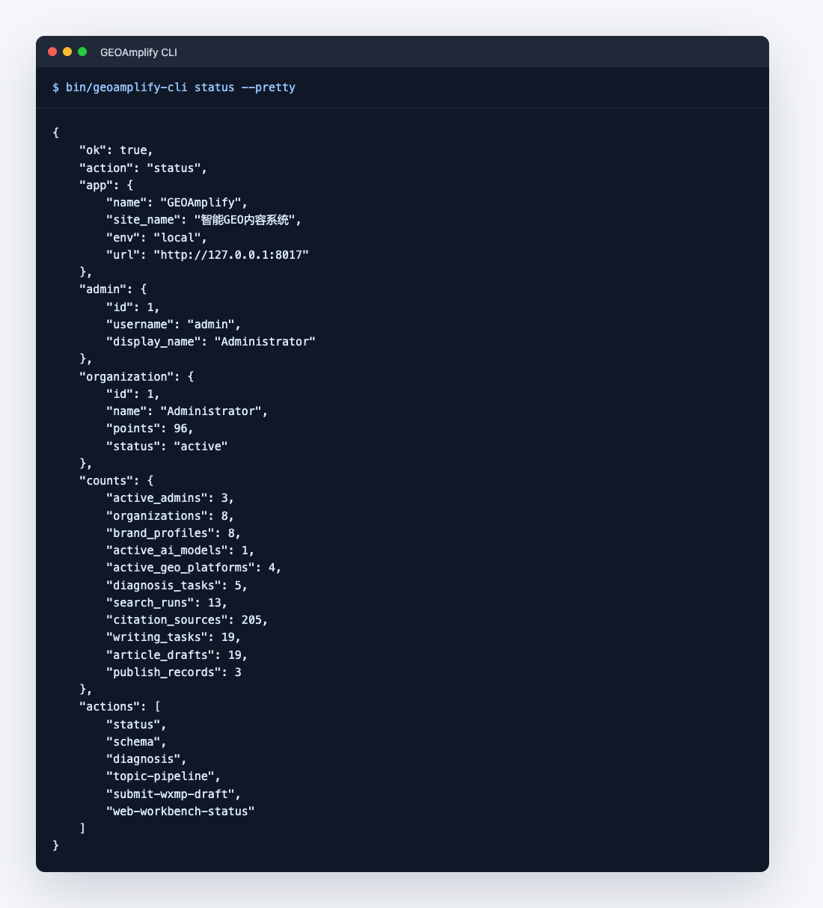
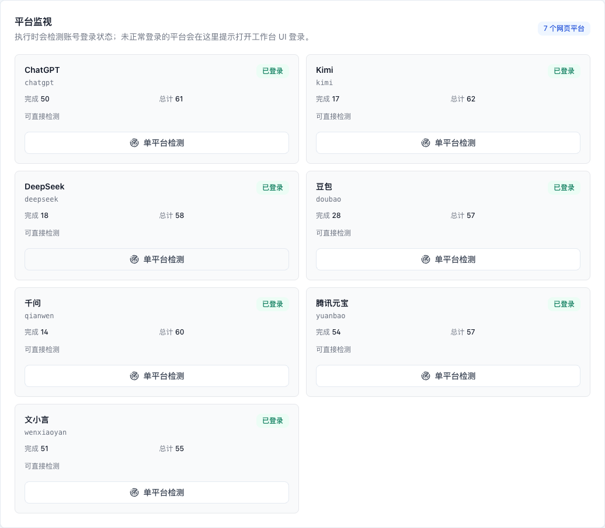
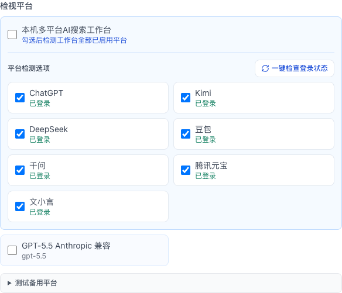

# 本地软件接入与环境配置

GEOAmplify 的主控场景是：Codex、本地桌面软件、脚本、Node/Python 程序或其他 Agent 在同一台电脑上调用项目 CLI，并通过浏览器 GUI 查看状态、配置模型、审核草稿和沉淀数据。项目按本机源码环境运行，需要你在本机准备 PHP、Composer、PostgreSQL 和可选 Redis。

## 1. 外部软件调用约定

外部软件应从项目根目录调用 CLI：

```bash
bin/geoamplify-cli status --pretty
```

如果外部软件不能设置工作目录，可以使用绝对路径：

```bash
/absolute/path/to/GEOAmplify/bin/geoamplify-cli status --pretty
```

`bin/geoamplify-cli` 会自动切换到项目根目录，再执行：

```bash
php artisan geoamplify:cli <action>
```

所有 action 都输出 JSON。外部软件只需要读取：

- `ok`
- `action`
- `error`
- 业务字段，例如 `draft.id`、`edit_url`、`publish_package.manifest_path`

不要让外部软件抓取页面 DOM 或依赖按钮文字；GUI 负责人工配置和验收，程序集成请走 CLI JSON。

## 2. 本机推荐 `.env`

公开仓库不会提交真实 `.env`，因为里面通常会保存数据库密码、模型 API Key 和发布平台密钥。新用户必须先复制模板，完整安装步骤见 [`../../INSTALL.md`](../../INSTALL.md)。

复制环境文件：

```bash
cp .env.example .env
```

也可以执行辅助脚本：

```bash
bash scripts/setup-local-env.sh
```

本机直接运行 PHP 时，推荐 `.env` 至少保持：

```env
APP_ENV=local
APP_DEBUG=true
APP_URL=http://127.0.0.1:8080
SITE_URL="${APP_URL}"
ADMIN_BASE_PATH=geo_admin

DB_CONNECTION=pgsql
DB_HOST=127.0.0.1
DB_PORT=5432
DB_DATABASE=geo_amplify
DB_USERNAME=geo_user
DB_PASSWORD=geo_password

REDIS_HOST=127.0.0.1
REDIS_PORT=6379
REDIS_PASSWORD=null

QUEUE_CONNECTION=redis
GEOAMPLIFY_GEO_ASYNC_JOBS=false
GEOAMPLIFY_TASK_REALTIME_ENABLED=false
```

如果本机暂时没有 Redis，只做低风险本地调试，可以先用同步队列：

```env
QUEUE_CONNECTION=sync
GEOAMPLIFY_GEO_ASYNC_JOBS=false
GEOAMPLIFY_TASK_REALTIME_ENABLED=false
```

生产或批量任务不建议使用 `sync`，应使用 Redis 并启动 queue worker。

## 3. 本机初始化命令

```bash
composer install --no-interaction --prefer-dist
php artisan key:generate
php artisan migrate --force
php artisan db:seed --force
php artisan storage:link
```

启动 GUI：

```bash
php artisan serve --host=127.0.0.1 --port=8080
```

后台地址：

```text
http://127.0.0.1:8080/geo_admin/login
```

默认管理员由 `.env` 控制：

```env
GEOAMPLIFY_ADMIN_USERNAME=admin
GEOAMPLIFY_ADMIN_PASSWORD=password
```

正式使用前必须修改默认密码。

## 4. 软件控制 CLI 必备配置

外部软件至少需要知道这些值：

| 配置项 | 推荐值 / 说明 |
|---|---|
| 项目根目录 | `/absolute/path/to/GEOAmplify` |
| CLI 命令 | `bin/geoamplify-cli` |
| GUI 地址 | `APP_URL` + `/` |
| 后台地址 | `APP_URL` + `/geo_admin/login`，路径受 `ADMIN_BASE_PATH` 控制 |
| 默认管理员 | `GEOAMPLIFY_ADMIN_USERNAME` |
| 输出格式 | JSON，必要时加 `--pretty` 便于人工阅读 |
| 成功判断 | 进程退出码为 `0` 且 JSON 中 `ok=true` |
| 失败判断 | 退出码非 `0` 或 JSON 中 `ok=false`，读取 `error` |

示例软件配置：

```json
{
  "name": "GEOAmplify",
  "cwd": "/absolute/path/to/GEOAmplify",
  "command": "bin/geoamplify-cli",
  "admin": "admin",
  "base_url": "http://127.0.0.1:8080",
  "admin_url": "http://127.0.0.1:8080/geo_admin/login",
  "output": "json"
}
```

本地软件调用 CLI 后应读取 JSON 输出，类似下面这样：



## 5. 常用 CLI 动作

探活：

```bash
bin/geoamplify-cli status --pretty
```

查看契约：

```bash
bin/geoamplify-cli schema --pretty
```

从选题生成草稿、配图位和发布包：

```bash
bin/geoamplify-cli topic-pipeline --admin=admin --json='{
  "topic": "重庆涪陵全屋定制板材环保等级怎么选",
  "platform_codes": ["ai_web_workbench:chatgpt", "ai_web_workbench:yuanbao"],
  "max_references": 2
}' --pretty
```

提交微信公众号草稿：

```bash
bin/geoamplify-cli submit-wxmp-draft --json='{
  "draft_id": 19,
  "platform_codes": ["weixingongzhonghao"]
}' --pretty
```

## 6. 多平台 AI 网页工作台

如果 `topic-pipeline` 需要调用本机多平台 AI 网页工作台，请配置：

```env
GEOAMPLIFY_AI_WEB_WORKBENCH_COMMAND=/absolute/path/to/ai-web-workbench
GEOAMPLIFY_AI_WEB_WORKBENCH_TIMEOUT=420
GEOAMPLIFY_AI_WEB_WORKBENCH_LOGIN_CHECK_TIMEOUT=90
GEOAMPLIFY_AI_WEB_WORKBENCH_DATA_DIR=/absolute/path/to/workbench-data
```

真实网页平台需要使用你自己的账号登录。凡是调用 `ai_web_workbench:*` 平台，例如：

```text
ai_web_workbench:chatgpt
ai_web_workbench:yuanbao
```

都要先在本机网页工作台里完成登录，并在后台点击 `一键检查登录状态`。GEOAmplify 不提供公共账号，不保存这些平台的网页密码，也不会绕过验证码、付费墙或平台风控。

后台中的平台登录状态示例：



GEO 工作台的检视任务里也可以直接做登录状态检查：



检查工作台状态：

```bash
bin/geoamplify-cli web-workbench-status --json='{"limit": 5}' --pretty
```

如果不配置真实网页工作台，可以先使用 Mock 平台或后台中已配置的真实 AI 模型做流程验收。

## 7. 蚁小二发布配置

微信公众号草稿提交链路需要：

```env
YIXIAOER_API_KEY=
YIXIAOER_API_URL=https://www.yixiaoer.cn/api
```

发布动作只提交草稿：

- `pubType=0`
- `notifySubscribers=0`

也就是说，它不会自动群发。

## 8. 队列与常驻进程

本地软件调试建议先保持同步：

```env
GEOAMPLIFY_GEO_ASYNC_JOBS=false
```

如果要运行批量采集、批量评分、发布后复测等异步任务：

```env
QUEUE_CONNECTION=redis
GEOAMPLIFY_GEO_ASYNC_JOBS=true
```

并启动：

```bash
php artisan queue:work redis --queue=geoamplify,default --sleep=1 --tries=1 --timeout=300
php artisan schedule:work
```

如果开启实时推送：

```env
GEOAMPLIFY_TASK_REALTIME_ENABLED=true
```

再启动：

```bash
php artisan reverb:start
```

不开启实时推送时不需要 Reverb。

## 9. 配置变更后刷新

修改 `.env` 后执行：

```bash
php artisan config:clear
php artisan cache:clear
```

如果改了路由、视图或部署缓存，再执行：

```bash
php artisan route:clear
php artisan view:clear
```

## 10. 最小自检

```bash
php artisan about
bin/geoamplify-cli status --pretty
bin/geoamplify-cli schema --pretty
```

`status` 返回 `ok=true` 后，外部软件即可开始调用业务动作。
